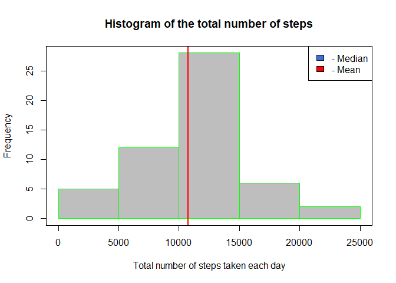
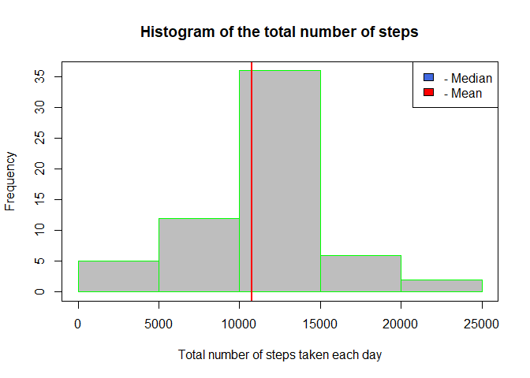

## Loading and preprocessing the data

```r
wdir <- getwd()
if (wdir != "E:/Luciano/R_WorkingDir/Reproducible Research/RepData_PeerAssessment1"){
    setwd("E:/Luciano/R_WorkingDir/Reproducible Research/RepData_PeerAssessment1")
}
rm(list = ls())
listfiles <- dir()
if ("activity.csv" %in% listfiles){
    actdf <- read.csv("activity.csv")
    newdf <- na.omit(actdf)
}else{
    if ("activity.zip" %in% listfiles){
        unzip(zipfile = "activity.zip")
        actdf <- read.csv("activity.csv") 
        newdf <- na.omit(actdf)
    }else{
        print("No files found!!!")
    }
}
```


## What is mean total number of steps taken per day?
- Update total steps per day.
- Show histogram with totals steps per day.
- Calculate mean and median of steps per day

```r
instpackages <- installed.packages()
if (("ggplot2" %in% instpackages)){
    library(ggplot2)
}else{
    install.packages("ggplot2")
    library(ggplot2)
}
totaldays <- tapply(newdf$steps, newdf$date, FUN = sum)
hist(totaldays, main = "Histogram of the total number of steps", 
     xlab = "Total number of steps taken each day", 
     col = "grey", border = "green")
meansteps <- mean(totaldays, na.rm = TRUE)
mediansteps <- median(totaldays, na.rm = TRUE)
abline(v = meansteps, col = "royalblue", lwd = 2)
abline(v = mediansteps, col = "red", lwd = 2)
legend("topright", c("- Median", "- Mean"), fill = c("royalblue", "red"))
box()
```

<!-- -->

- **Mean: ** 1.0766189\times 10^{4}
- **Median: ** 10765

## What is the average daily activity pattern?
- Calcluate mean value of steps for every interval.
- Detect 5-minutes interval with maximum number of steps

```r
intersteps <- with(newdf, aggregate(steps ~ interval, newdf, mean))
plot(x = intersteps$interval, y = intersteps$steps, type = "l"
     , col = "blue", main = "Average daily activity pattern",
     xlab = "Interval", ylab = "Average number of steps")
```

<!-- -->

```r
maxinterval <- intersteps[which.max(intersteps$steps),]$interval
```
- Interval with maximum number of steps: **835**

## Imputing missing values
- Calculate the complete cases with no NA's
- Eliminate steps with NA and substitute by mean value in the same interval
- Create a new data set without NA's
 

```r
totalincomplete <- sum(is.na(actdf$steps)) 
newactdf <- actdf
for (i in 1:nrow(newactdf)) {
    if (is.na(newactdf$steps[i])){
        interval <- newactdf$interval[i]
        stepsmean <- intersteps$steps[intersteps$interval == interval]
        newactdf$steps[i] <- stepsmean
    }
}
newtotaldays <- tapply(newactdf$steps, newactdf$date, FUN = sum)
hist(newtotaldays, main = "Histogram of the total number of steps", 
     xlab = "Total number of steps taken each day", 
     col = "grey", border = "green")
newmeansteps <- mean(newtotaldays, na.rm = TRUE)
newmediansteps <- median(newtotaldays, na.rm = TRUE)
abline(v = newmeansteps, col = "royalblue", lwd = 2)
abline(v = newmediansteps, col = "red", lwd = 2)
legend("topright", c("- Median", "- Mean"), fill = c("royalblue", "red"))
box()
```

<!-- -->

```r
diffmean <- (newmeansteps - meansteps)
diffmedian <- (newmediansteps - mediansteps)
```

- Total NA's in the initial dataset: **2304**
- **Mean: ** 1.0766189\times 10^{4} before 1.0766189\times 10^{4}
    - Difference in the mean is: 0
- **Median: ** 1.0766189\times 10^{4} before 10765
    - Difference in the medain is: 1.1886792

## Are there differences in activity patterns between weekdays and weekends?
- Create a factor to separeate weekdays and weekends

```r
wend <- c("Saturday", "Sunday")
newactdf$weekend <- factor((weekdays(as.Date(newactdf$date)) %in% wend), 
                           levels = c(FALSE, TRUE), labels = c("weekday", "weekend"))
```
